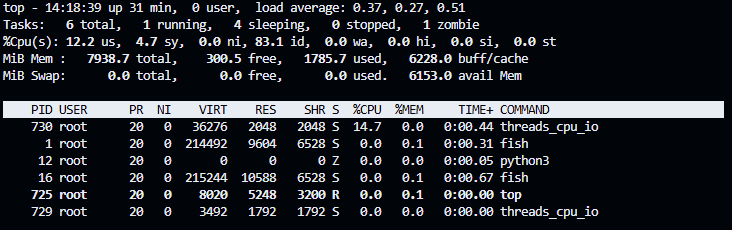
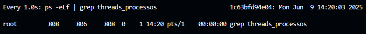
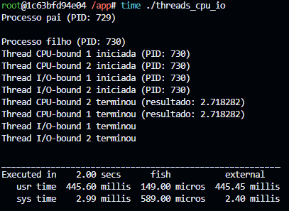
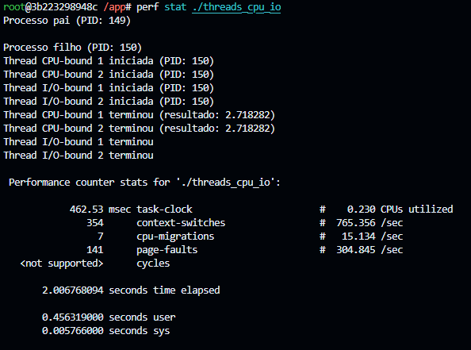

# Relatório atividade 4 - Sistemas Operacionais - Ryan Ferreira Paulista 

## Resultados obtidos:
Execução do comando top:

Execução do comando watch:

Execução do comando time:

Execução do comando perf:

Para execução do comando perf foi necessário executar o container com atributo --privileged.